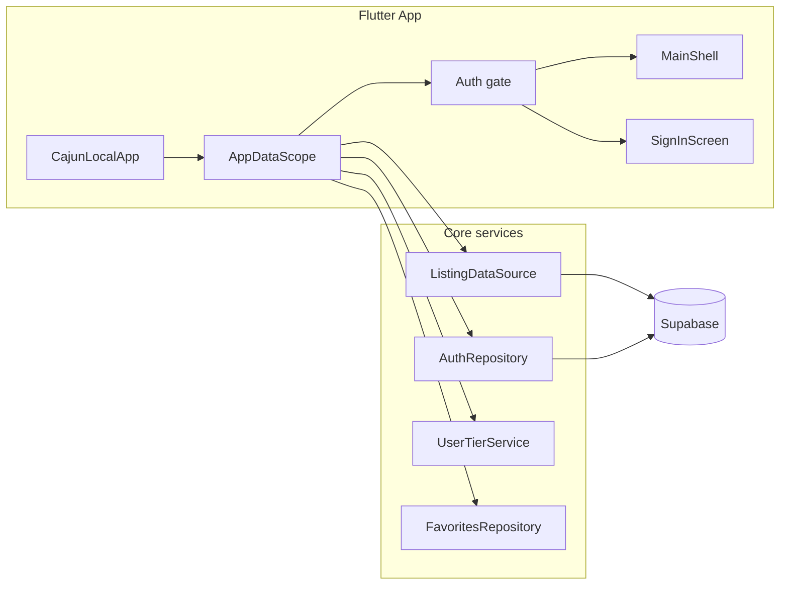

# Cajun Local — Application Overview

This document describes what the application is, all features and functionality, and how the pieces connect (Flutter app, Supabase backend, auth, subscription tiers, admin). It complements the technical cheatsheets in `docs/` (backend, Stripe, messaging, etc.) by focusing on *what* the app does and *how it fits together*.

**Audience:** New developers, stakeholders, or future you.

---

## 1. What the app is

- **Product name:** Cajun Local
- **Purpose:** Members-only platform connecting the Acadiana (Louisiana) community with locally owned businesses. Users discover listings, deals, and events and support local; businesses get a listing, deals, events, and optional ads.
- **Tech stack:** Flutter app + Supabase (Postgres, PostgREST, Auth, Storage, Edge Functions). Optional Stripe for subscriptions and payments.
- **Geography:** Fixed to Louisiana — businesses are in parishes (e.g. Lafayette, St. Martin); filters and forms use the parishes list. No mock-only mode in production: when Supabase is configured, [ListingDataSource](lib/core/data/listing_data_source.dart) uses it; otherwise the app shows "Loading data failed."

---

## 2. High-level architecture

App entry and data flow:

- **Entry:** [app.dart](lib/app/app.dart) builds `CajunLocalApp` → wraps the tree in `AppDataScope` (dataSource, authRepository, favoritesRepository, userTierService) and `FavoritesScope` (favoriteIds). Then an auth gate: if Supabase is not configured, show `MainShell` anyway; if user is in password-recovery mode, show `SetNewPasswordScreen`; if signed in, show `MainShell`; otherwise show `SignInScreen`.
- **Main shell:** [main_shell.dart](lib/app/main_shell.dart) — bottom navigation: Home, Explore (categories), Favorites, Deals, Profile. End drawer (menu): Ask Local, Choose for Me, Local Events, Notifications, Messages, Admin (if user has admin role), Sign out. Parish onboarding dialog may show once after sign-in.
- **Data flow:** Screens call `AppDataScope.of(context)` to get `dataSource`, `authRepository`, `userTierService`, `favoritesRepository`. The data source and repos talk to Supabase; repositories live in [lib/core/data/repositories/](lib/core/data/repositories/).

---

## 3. Member-facing features

| Feature | Description | Key screen / widget |
|--------|-------------|----------------------|
| **Home** | Hero, search bar, quick actions (Deals, Events, Choose for Me), "Popular Near You" (featured spots), "Local Latests" (blog teasers), "Browse by category". Dismissible notification banner. | [HomeScreen](lib/features/home/presentation/screens/home_screen.dart) |
| **Explore (Categories)** | Browse and filter by category and subcategory, parish; search by name/category; open listing detail. | [CategoriesScreen](lib/features/categories/presentation/screens/categories_screen.dart) |
| **Favorites** | Saved businesses list. Gated by tier: free = 3 max; plus/pro = higher or unlimited (see [ResolvedPermissions](lib/core/subscription/resolved_permissions.dart), [UserTierService](lib/core/subscription/user_tier_service.dart)). | [FavoritesScreen](lib/features/favorites/presentation/screens/favorites_screen.dart) |
| **Deals** | List of approved deals; claim deal (tier-gated); "Quick scan" for punch/loyalty cards. | [DealsScreen](lib/features/deals/presentation/screens/deals_screen.dart), [ScanPunchScreen](lib/features/deals/presentation/screens/scan_punch_screen.dart) |
| **Profile** | Account info, parish preferences, My Listings entry (if any), About, Privacy policy, Sign out. Parish onboarding dialog on first use. | [ProfileScreen](lib/features/profile/presentation/screens/profile_screen.dart) |
| **My Listings** | Add/request a listing (gated: Cajun+ required via `canSubmitBusiness`); list owned and pending listings; open listing edit/dashboard. | [MyListingsScreen](lib/features/my_listings/presentation/screens/my_listings_screen.dart), [ListingEditScreen](lib/features/my_listings/presentation/screens/listing_edit_screen.dart) |
| **Ask Local** | AI-powered local recommendations (Cajun+ / Pro only). | [AskLocalSheet](lib/shared/widgets/ask_local_sheet.dart) |
| **Choose for Me** | Random pick (e.g. restaurant). | [ChooseForMeScreen](lib/features/choose_for_me/presentation/screens/choose_for_me_screen.dart) |
| **Local Events** | Approved events from all businesses. | [LocalEventsScreen](lib/features/local_events/presentation/screens/local_events_screen.dart) |
| **Messaging** | Conversations with businesses; inbox and thread view. | [MyConversationsScreen](lib/features/messaging/presentation/screens/my_conversations_screen.dart), [ConversationThreadScreen](lib/features/messaging/presentation/screens/conversation_thread_screen.dart) |
| **Notifications** | In-app notifications list. | [NotificationsScreen](lib/features/notifications/presentation/screens/notifications_screen.dart) |
| **Listing detail** | Business info, hours, menu, deals, events, map, contact, claim business (unclaimed only). | [ListingDetailScreen](lib/features/listing/presentation/screens/listing_detail_screen.dart) |

---

## 4. Subscription tiers and permissions

- **Tiers:** free, plus (Cajun+), pro. Driven by [user_plans](lib/core/data/repositories/user_plans_repository.dart) and [user_subscriptions](lib/core/data/repositories/user_subscriptions_repository.dart); resolved in [UserTierService](lib/core/subscription/user_tier_service.dart) and [ResolvedPermissions](lib/core/subscription/resolved_permissions.dart).
- **Key permissions:** `canClaimDeals`, `canSeeExclusiveDeals`, `canSubmitBusiness`, `canUseAskLocal`, `maxFavorites`. Free tier: limited favorites, no deal claims, no business submit, no Ask Local.
- **Stripe:** Checkout for subscriptions and payments. See [Stripe Cheat Sheet](stripe-cheatsheet.md) and [Pricing and Ads Cheat Sheet](pricing-and-ads-cheatsheet.md).

---

## 5. Business / manager features

- **Claim business:** A user requests ownership of an unclaimed listing; admin approves. On approval, a DB trigger adds the user to `business_managers` and sets `user_roles.role` to `business_owner` ([claim_approved_trigger](supabase/migrations/20260221100000_claim_approved_trigger.sql)).
- **Listing edit (manager):** Once a manager, the user can edit their business: profile, hours, links, menu (sections/items), deals, events, punch cards, images, and view form submissions. Managers use [ListingEditScreen](lib/features/my_listings/presentation/screens/listing_edit_screen.dart) from My Listings; admins use [AdminBusinessDetailScreen](lib/features/admin/presentation/screens/admin_business_detail_screen.dart) for full detail and approval actions.
- **Deal tier enforcement:** Deal limits and advanced deal types (e.g. flash, member_only) are enforced by DB triggers; see [business_tier_deal_enforcement](supabase/migrations/20260221180000_business_tier_deal_enforcement.sql).

---

## 6. Admin dashboard

- **Entry:** Menu → Admin, shown only when `user_roles.role = 'admin'`. [AdminShell](lib/features/admin/presentation/screens/admin_shell.dart) hosts all sections; the list is defined in [admin_sections.dart](lib/features/admin/presentation/screens/admin_sections.dart).
- **Sections:** Dashboard, Businesses, Reviews, Claims, Pending approvals, Form submissions, Blog posts, Manage banners (category banners), Categories, Parishes, Subscriptions, Ad packages, Business ads, Payment history, Users (roles), Send notification, Email templates, Audit log.
- **Notable flows:** Approve/reject businesses, reviews, claims, deals, images; manage categories and subcategories, parishes; manage blog and category banners; view and reply to form submissions; view payment history; manage user roles; send in-app notifications; edit email templates; view audit log.

---

## 7. Backend (Supabase) — how it connects

- **Database:** Schema and RLS are applied via migrations in [supabase/migrations/](supabase/migrations/). Order and dependencies are documented in [supabase/migrations/README.md](supabase/migrations/README.md). Core tables include businesses, business_categories, subcategories, business_managers, user_roles, parishes; RLS policies use `auth.uid()`, `has_role()`, `is_business_manager()`; triggers handle claim approval, slug generation, and email queue enqueue.
- **Auth:** Supabase Auth; profiles and user_roles; RLS and app logic key off auth state and roles.
- **Data access:** Repositories in [lib/core/data/repositories/](lib/core/data/repositories/) call the Supabase client. [ListingDataSource](lib/core/data/listing_data_source.dart) aggregates these repos for the app. Edge functions (e.g. [blog-sync](supabase/functions/blog-sync/index.ts)) handle external integrations.
- **Reference:** For a full table list and schema details, see [Backend Cheat Sheet](backend-cheatsheet.md).

---

## 8. How things connect (summary)

- **Auth → tier → permissions:** Auth state drives `UserTierService`, which resolves `ResolvedPermissions`. The UI gates favorites limit, add listing, Ask Local, and deal claims based on these permissions.
- **Admin:** `user_roles.role = 'admin'` controls Admin menu visibility and access; many tables are RLS-protected with `has_role(auth.uid(), 'admin')`.
- **Manager:** `business_managers` (or `businesses.created_by`) is used by `is_business_manager()` in RLS so managers can edit their businesses, view form submissions, and perform other manager-only actions.
- **Listings:** Businesses have status (e.g. approved, pending, rejected). Only approved businesses appear in Explore and public listing detail. Categories, subcategories, and parishes filter and organize listings; admin manages status and content.
